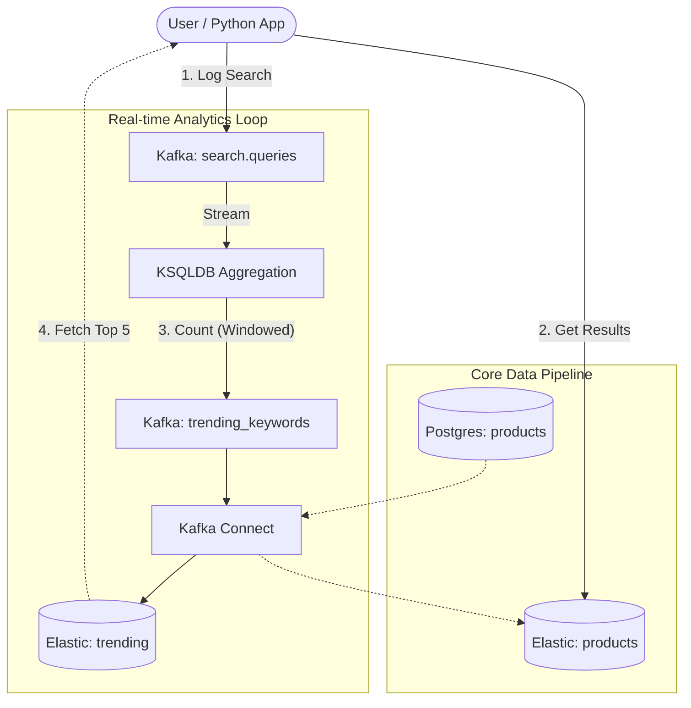
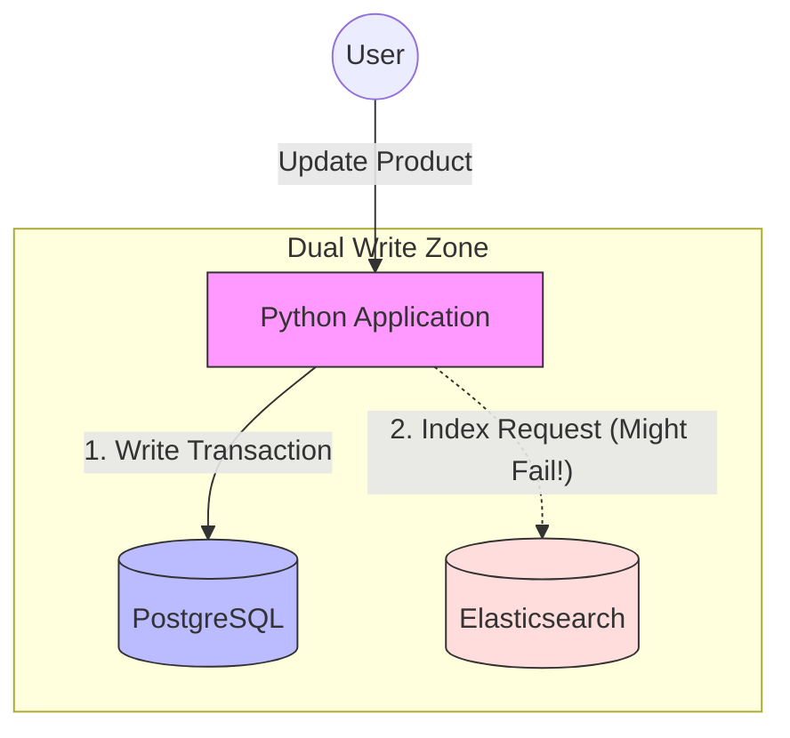
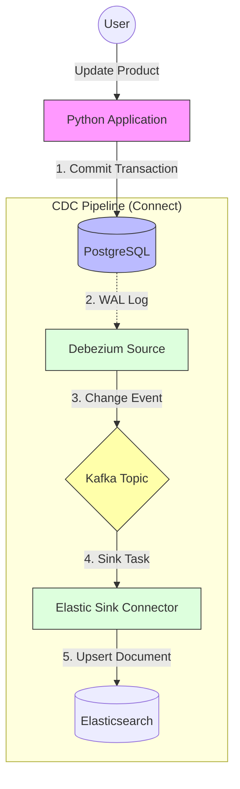

# Realtime Search Engine

A Realtime Search Engine pipeline demonstrating how to sync a transactional Product Catalog (PostgreSQL) with a Search Engine (Elasticsearch) using Kafka and Debezium.

## Architecture




## Deep Dive: Architectural Patterns (CDC vs Dual-Write)

This section illustrates the difference between the traditional "Dual Write" anti-pattern and the robust "Change Data Capture (CDC)" pattern implemented in this system.

### 1. The "Dual Write" Anti-Pattern
In a traditional setup without Kafka Connect, the application is responsible for writing to *both* the Database and the Search Engine simultaneously.

**The Problem:** If the App crashes or the Network fails *after* step 1 but *before* step 2, your Database has the product, but your Search Engine does not. **Data is permanently inconsistent.**



### 2. The "CDC" Pattern (Event-Driven Architecture)
This project utilizes an **Event-Driven** approach to decouple writes from reads.

**The Solution:** The Application *only* writes to the Database (Single Source of Truth). The **Pipeline** handles synchronization.
*   **Resiliency**: If the Sync fails, Kafka retries indefinitely.
*   **Guaranteed Consistency**: Data in PostgreSQL is guaranteed to eventually propagate to Elasticsearch.




## Prerequisites

- Docker & Docker Compose
- `jq` (optional, for pretty printing JSON)

## Getting Started

### 1. Start Infrastructure
Start all services (Kafka, Postgres, Elastic, Connect, etc.):
```bash
docker-compose up -d
```
Wait for about 60 seconds for all services to be healthy.

### 2. Configure Connectors
Run the setup script to link Postgres to Kafka to Elastic:
```bash
./scripts/setup-connectors.sh
```

### 3. Generate Data
Insert sample random products into Postgres:
```bash
chmod +x data/populate-products.sh
./data/populate-products.sh
```

### 4. Search in Realtime
You can now search for the new products in Elasticsearch.

**Check via Curl:**
```bash
curl "localhost:9200/dbserver1.public.products/_search?q=category:Electronics&pretty"
```

**Check via Kibana:**
1. Open [http://localhost:5601](http://localhost:5601).
2. Go to **Dev Tools**.
3. Run query:
   ```json
   GET /dbserver1.public.products/_search
   {
     "query": {
       "match": {
         "name": "Pro"
       }
     }
   }
   ```

### 5. Run Search Analytics Loop (New) 🚀

This project now includes a **Real-time Search Analytics** feedback loop.

1.  **Start KSQL Analytics**:
    ```bash
    ./scripts/setup-analytics.sh
    ```
    *(Configures the stream processing to calculate trending keywords)*

2.  **Run the Search App**:
    (Requires Python 3.8+)
    ```bash
    cd client
    pip install -r requirements.txt
    python3 app.py
    ```

3.  **Test It**:
    -   In the app, search for "laptop" multiple times.
    -   Watch the "🔥 Trending" section update in real-time!

## Key Components

- **Source**: `products` table in Postgres.
- **Topic**: `dbserver1.public.products` (created automatically by Debezium).
- **Index**: `dbserver1.public.products` in Elasticsearch.

## Troubleshooting

- **Check Connectors**: `curl localhost:8083/connectors/source-postgres-products/status`
- **View Kafka Topic**:
  ```bash
  docker exec kcat kcat -b broker:29092 -C -t dbserver1.public.products -o end
  ```
